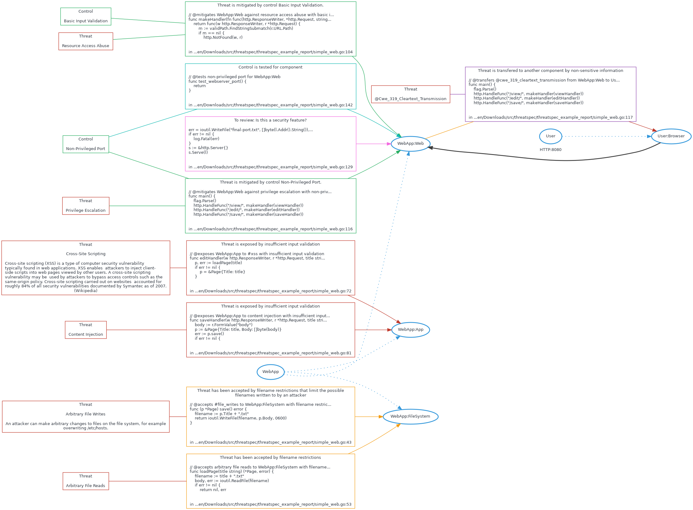

# Threatspec Project Threat Model

A threatspec project.


# Diagram



# Exposures

## Cross-site scripting against WebApp:App
Insufficient input validation

```
// @exposes WebApp:App to #xss with insufficient input validation
func editHandler(w http.ResponseWriter, r *http.Request, title string) {
    p, err := loadPage(title)
    if err != nil {
        p = &Page{Title: title}

```
/home/zeroxten/Downloads/src/threatspec/threatspec_example_report/simple_web.go:72

## Content injection against WebApp:App
Insufficient input validation

```
// @exposes WebApp:App to content injection with insufficient input validation
func saveHandler(w http.ResponseWriter, r *http.Request, title string) {
    body := r.FormValue("body")
    p := &Page{Title: title, Body: []byte(body)}
    err := p.save()

```
/home/zeroxten/Downloads/src/threatspec/threatspec_example_report/simple_web.go:81


# Acceptances

## Arbitrary file writes to WebApp:FileSystem
Filename restrictions that limit the possible filenames written to by an attacker

```
// @accepts #file_writes to WebApp:FileSystem with filename restrictions that limit the possible filenames written to by an attacker
/*
@mitigates WebApp:FileSystem against unauthorised access with #file_perms:
  description: Access is limited strictly to the owner of the file
*/

```
/home/zeroxten/Downloads/src/threatspec/threatspec_example_report/simple_web.go:43

## Arbitrary file reads to WebApp:FileSystem
Filename restrictions

```
// @accepts arbitrary file reads to WebApp:FileSystem with filename restrictions
func loadPage(title string) (*Page, error) {
    filename := title + ".txt"
    body, err := ioutil.ReadFile(filename)
    if err != nil {

```
/home/zeroxten/Downloads/src/threatspec/threatspec_example_report/simple_web.go:53


# Transfers


# Mitigations

## Resource access abuse against WebApp:Web mitigated by Basic input validation


```
// @mitigates WebApp:Web against resource access abuse with basic input validation
func makeHandler(fn func(http.ResponseWriter, *http.Request, string)) http.HandlerFunc {
    return func(w http.ResponseWriter, r *http.Request) {
        m := validPath.FindStringSubmatch(r.URL.Path)
        if m == nil {

```
/home/zeroxten/Downloads/src/threatspec/threatspec_example_report/simple_web.go:104

## Privilege escalation against WebApp:Web mitigated by Non-privileged port


```
// @mitigates WebApp:Web against privilege escalation with non-privileged port
// @transfers @cwe_319_cleartext_transmission from WebApp:Web to User:Browser with non-sensitive information
func main() {
    flag.Parse()
    http.HandleFunc("/view/", makeHandler(viewHandler))

```
/home/zeroxten/Downloads/src/threatspec/threatspec_example_report/simple_web.go:116
### Tests

#### Non-privileged port for WebApp:Web

```
// @tests non-privileged port for WebApp:Web
func test_webserver_port() {
    // TODO: implment test code here
    return
}

```
/home/zeroxten/Downloads/src/threatspec/threatspec_example_report/simple_web.go:142


# Reviews

## WebApp:Web
Is this a security feature?

```
        err = ioutil.WriteFile("final-port.txt", []byte(l.Addr().String()), 0644) // @review WebApp:Web Is this a security feature?
        if err != nil {
            log.Fatal(err)
        }
        s := &http.Server{}

```
/home/zeroxten/Downloads/src/threatspec/threatspec_example_report/simple_web.go:129


# Connections

## User:Browser To WebApp:Web
HTTP:8080

```
    http.ListenAndServe(":8080", nil) // @connects User:Browser to WebApp:Web with HTTP:8080

}

// @tests non-privileged port for WebApp:Web

```
/home/zeroxten/Downloads/src/threatspec/threatspec_example_report/simple_web.go:138


# Components

## WebApp:Web

## WebApp:App

## User:Browser

## WebApp:FileSystem


# Threats

## Resource access abuse


## Privilege escalation


## Cross-site scripting
| Custom Key | Value |
| --- | --- |
| **Impact** | high |


### Description
Cross-site scripting (XSS) is a type of computer security vulnerability typically found in web applications. XSS enables 
attackers to inject client-side scripts into web pages viewed by other users. A cross-site scripting vulnerability may be 
used by attackers to bypass access controls such as the same-origin policy. Cross-site scripting carried out on websites 
accounted for roughly 84% of all security vulnerabilities documented by Symantec as of 2007. (Wikipedia)


## Content injection


## @cwe_319_cleartext_transmission


## Arbitrary file writes
| Custom Key | Value |
| --- | --- |
| **Impact** | high |


### Description
An attacker can make arbitrary changes to files on the file system, for example overwriting /etc/hosts.


## Arbitrary file reads


# Controls

## Non-privileged port

## Basic input validation
